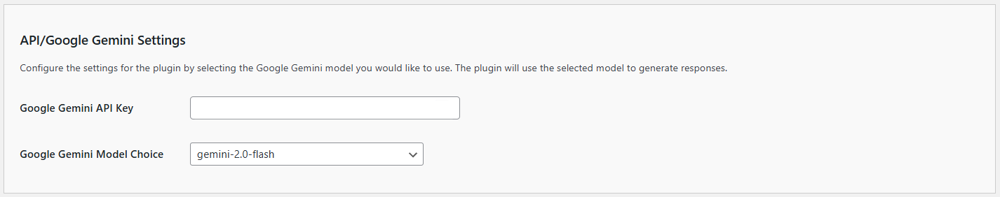
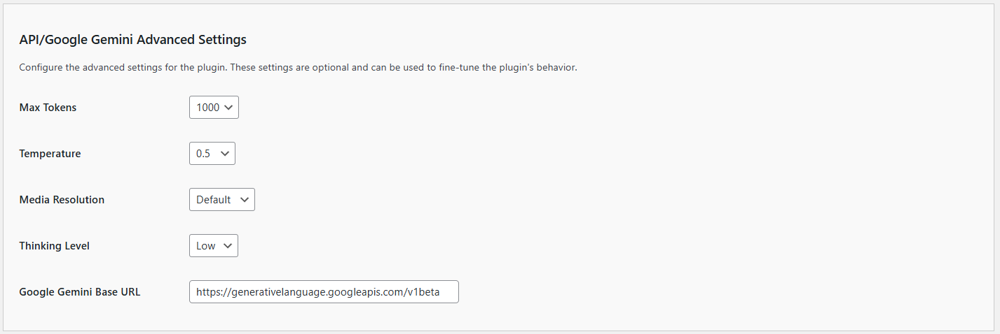

# API/Google Gemini Settings

The **Kognetiks AI Summaries** plugin requires proper configuration to function correctly. Follow the steps below to set up your plugin:

1. **Google Gemini API Key**:

   - **Description**: This field is for your Google Gemini API key, which is necessary for the plugin to access the Google Gemini's API'.
   - **How to obtain**: You can get your API key by signing up at [Google Gemini's API keys page](https://aistudio.google.com/api-keys).
   - **Input**: Paste your API key in the provided field.
   
2. **Google Gemini Model Choice**:
   - **Description**: This setting allows you to choose the default Google Gemini model to generate page, post and other content summaries.
   - **Options**: Depending on the available models, you can select from various options such as `gemini-2.0-flash` and others.
   - **How to Set**: Select the desired model from the dropdown list.

## Steps to Configure

1. Navigate to the API/Google Gemini Settings section of the Kognetiks AI Summaries plugin in your WordPress dashboard.

2. Copy your Google Gemini API key from the [Google Gemini API keys page](https://aistudio.google.com/api-keys).

3. Paste the API key into the `Google Gemini API Key` field.

4. Click the `Save Settings` to save your API key.

5. After entering a valid API Key, you will be able to select the Google Gemini Model of your choice from those offered by the AI vendor.

6. If you change the Google Gemini Model Choice, remember to click the `Save Settings`.

# API/Google Gemini Advanced Settings

1. **Maximum Tokens Setting**:
   - **Description**: This setting determines the maximum number of tokens (words and parts of words) the model can use in a single response. This helps control the length and detail of the responses.
   - **Default Value**: The default is set to `500` tokens, but it can be increased up to `4000` tokens in increments of `100`.
   - **How to Set**: Enter the desired number of tokens in the provided field, for example, `1000`.

2. **Temperature**:
   - **Description**: This setting controls the randomness of the model's responses. A lower value (closer to 0) makes the output more focused and deterministic, while a higher value (closer to 1) makes it more random and creative.
   - **Default Value**: The default is set to `0.5`.
   - **How to Set**: Use the dropdown menu to select a value between `0` and `1`.

3. **Media Resolution**:
   - **Description**: This setting controls image resolution. Choose a resolution that balances detail with processing speed and token usage. Higher resolutions are better for detailed image analysis but consume more tokens.
   - **Default Value**: The default is set to `Default`.
   - **How to Set**: Use the dropdown menu to select either `Default`, `Low`, `Medium`, or `High`.

4. **Thinking Level**:
   - **Description**: This setting controls the thinking level. Use "High" thinking level for complex problem-solving tasks, but expect longer response times. Use "Low" for faster, more straightforward interactions.
   - **Default Value**: The default is set to `Low`.
   - **How to Set**: Use the dropdown menu to select either `Low` or `High`.

5. **Google Gemini Base URL**:
   - **Description**: This field specifies the base URL for the Google Gemini API. The plugin uses this URL to connect to the Google Gemini servers.
   - **Default Value**: The default URL is `https://generativelanguage.googleapis.com/v1beta`.
   - **Customization**: Typically, you should not need to change this value unless there are specific requirements for your integration.

## Steps to Configure

1. Navigate to the API/Google Gemini Advanced Settings section of the Kognetiks AI Summaries plugin in your WordPress dashboard.

2. Adjust the maximum tokens setting appropriate for your needs.

3. Adjust the temperature setting to control the creativity of the responses.

4. Adjust the Media Resolution setting to control image resolution.

5. Adjust the Thinking Level setting to control how to handle complex summaries or more straightforward summarization.

6. Generally, you'll leave the `Google Gemini Base URL` unchanged.

7. Click the `Save Settings` to save any changes you've made to the settings.

---

- **[Back to the Overview](/overview.md)**
