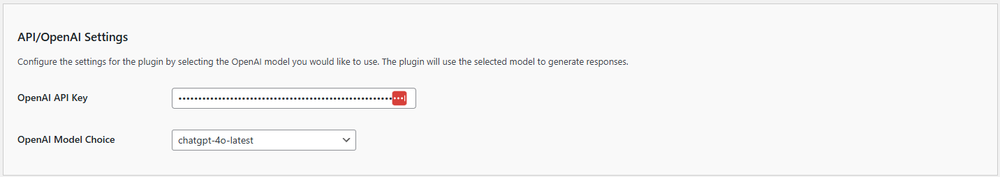
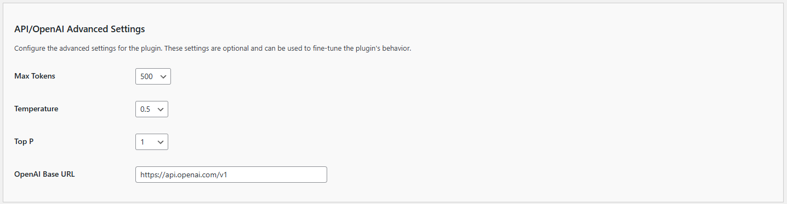

# API/OpenAI Settings

The **Kognetiks AI Summaries** plugin requires proper configuration to function correctly. Follow the steps below to set up your plugin:

1. **OpenAI API Key**:

   - **Description**: This field is for your OpenAI API key, which is necessary for the plugin to access the ChatGPT functionality.
   - **How to obtain**: You can get your API key by signing up at [OpenAI's API keys page](https://platform.openai.com/account/api-keys).
   - **Input**: Paste your API key in the provided field.
   
2. **OpenAI Model Choice**:
   - **Description**: This setting allows you to choose the default OpenAI model to generate page, post and other content summaries.
   - **Options**: Depending on the available models, you can select from various options such as `chatgpt-4o-latest` and others.
   - **How to Set**: Select the desired model from the dropdown list.

## Steps to Configure

1. Navigate to the API/OpenAI Settings section of the Kognetiks AI Summaries plugin in your WordPress dashboard.

2. Copy your OpenAI API key from the [OpenAI API keys page](https://platform.openai.com/account/api-keys).

3. Paste the API key into the `OpenAI API Key` field.

4. Click the `Save Settings` to save your API key.

5. After entering a valid API Key, you will be able to select the OpenAI Model of your choice from those offered by the AI vendor.

6. If you change the OpenAI Model Choice, remember to click the `Save Settings`.

# API/OpenAI Advanced Settings

1. **Maximum Tokens Setting**:
   - **Description**: This setting determines the maximum number of tokens (words and parts of words) the model can use in a single response. This helps control the length and detail of the responses.
   - **Default Value**: The default is set to `500` tokens, but it can be increased up to `4000` tokens in increments of `100`.
   - **How to Set**: Enter the desired number of tokens in the provided field, for example, `1000`.

2. **Temperature**:
   - **Description**: This setting controls the randomness of the model's responses. A lower value (closer to 0) makes the output more focused and deterministic, while a higher value (closer to 1) makes it more random and creative.
   - **Default Value**: The default is set to `0.5`.
   - **How to Set**: Use the dropdown menu to select a value between `0` and `1`.

3. **Top P**:
   - **Description**: This setting, also known as "nucleus sampling," controls the diversity of the responses. It considers the smallest possible set of words whose cumulative probability is greater than or equal to the value of `Top P`.
   - **Default Value**: The default is set to `1`.
   - **How to Set**: Use the dropdown menu to select a value between `0` and `1`.

4. **OpenAI Base URL**:
   - **Description**: This field specifies the base URL for the OpenAI API. The plugin uses this URL to connect to the OpenAI servers.
   - **Default Value**: The default URL is `https://api.openai.com/v1`.
   - **Customization**: Typically, you should not need to change this value unless there are specific requirements for your integration.

## Steps to Configure

1. Navigate to the API/OpenAI Advanced Settings section of the Kognetiks AI Summaries plugin in your WordPress dashboard.

2. Adjust the maximum tokens setting appropriate for your needs.

3. Adjust the temperature setting to control the creativity of the responses.

4. Adjust the Top P setting to manage the diversity of the responses.

5. Generally, you'll leave the `OpenAI Base URL` unchanged.

6. Click the `Save Settings` to save any changes you've made to the settings.

---

- **[Back to the Overview](/overview.md)**
