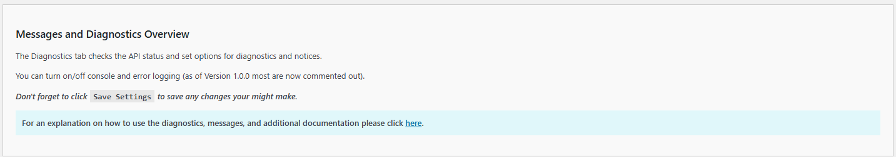
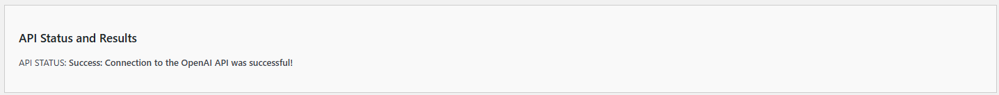
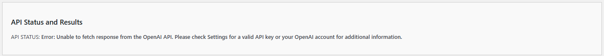
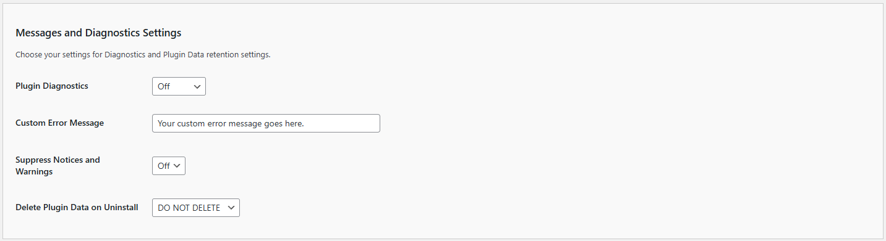

# Diagnostics

The Diagnostics Settings allow you to customize the basic behavior the **Kognetiks AI Summary** plugin. Follow these steps to configure these options:

## AI Platform Selection

1. **Platform Settings**:

   - **Description**: Displays key information about your system and the plugin, including PHP version, WordPress version, PHP memory limits, plugin version, and WordPress language code.
   - **Usage**: Use this information for troubleshooting and ensuring compatibility with your environment.

## AI Status and Results

1. **API Status and Results**:

   - **Description**: Displays the API status, either `Success` or `Error`, along with any message.
   - **Note**: An valid API key obtained from the respective model vendor is required for the plugin to operate correctly.

## Messages and Diagnostics Settings

1. **Plugin Diagnostics**:
   - **Description**: Allows you to select the level of diagnostics to be logged.
   - **Options**: 
     - `Off`: No logging.
     - `Success`: Success messages.
     - `Notice`: General messages.
     - `Failure`: Failure messages.
     - `Warning`: Warning massages.
     - `Error`: Error messages.
   - **Selection**: Choose the appropriate level based on your need for diagnostics information. `Off` is the default and recommended setting for general use. Use `Error` for in-depth troubleshooting. `Error` logs all levels.

   **NOTE:** You can enable error and console logging at any time, however in the production releases of the plugin all error logging has been commented out.

2. **Custom Error Message**:
   - **Description**: This setting allows administrators to define a custom error message that will be displayed to users when the plugin encounters an issue. This ensures a more consistent and branded user experience, even in cases of unexpected errors.
   - **Options**: Any text string that you want to use as the error message.
   - **Selection**: Enter your preferred error message in the provided text field on the `Diagnostics` tab. An example of a custom error message could be:
     `
     Sorry, a brief summary isn't available right now.  Please check back later.
     `
   - **Additional Requirements**:
     - **Kognetiks AI Summaries Diagnostics**: Ensure that the Kognetiks AI Summaries Diagnostics setting is turned from `Off` to `Error` to enable the display of custom error messages.
     - **WordPress Error Logging**: You may also need to turn on WordPress error logging to fully utilize this feature.

3. **Suppress Notices and Warnings**:
   - **Description**: Allows you to suppress notices and warnings such as those associated with administrative functions of the plugin.  These messages and warnings are not shown to users, only to site administrators.
   - **Options**: `On` or `Off`.
   - **Selection**: Choose `On` to suppress notices and warnings if you prefer a less verbose experience, otherwise set to `Off` to see all administrative messages associated with the plugin.

4. **Delete Plugin Data on Uninstall**:
   - **Description**: Determines whether to delete all plugin data when the plugin is uninstalled.
   - **Options**: `Yes` or `No`.
   - **Selection**: Choose `Yes` to delete all data when uninstalling the plugin, ensuring no residual data remains. Select `No` to retain data even after uninstallation, which can be useful if you plan to reinstall the plugin later.

## Steps to Configure

1. Navigate to the `Diagnostics` tab of the **Kognetiks AI Summary** plugin in your WordPress dashboard.

2. Review the **System and Plugin Information** to ensure compatibility and identify the current versions in use.

3. Check the **API Test Results** to confirm a successful connection to your selected AI platform's API.

4. Set the **Plugin Diagnostics** level based on your need for error and performance logging.

5. Add a **Custom Error Message** if needed to match your preferences.

6. Toggle **Suppress Notices and Warnings** to `On` or `Off` as desired.

7. Decide whether to enable **Delete Plugin Data on Uninstall** by setting it to `Yes` or `No`.

8. Click `Save Settings` to apply your changes.

---

* **[Back to the Overview](/overview.md)**
