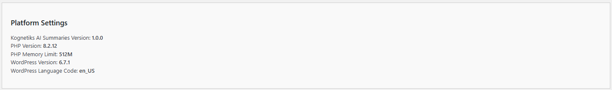

# Diagnostics Settings

The Diagnostics Settings allow you to customize the basic behavior the Kognetiks AI Summary plugin. Follow these steps to configure these options:

## AI Platform Selection

1. **System and Plugin Information**:

   - **Description**: Displays key information about your system and the plugin, including PHP version, WordPress version, plugin version, and WordPress language code.
   - **Options**: `OpenAI`, `NVIDIA`, `Anthropic` and others to be announced.
   - **Usage**: Use this information for troubleshooting and ensuring compatibility with your environment.

1. **System and Plugin Information**:

   - **Description**: This setting determines which AI model provider will be used for AI summarization.
   - **Options**: `OpenAI`, `NVIDIA`, `Anthropic` and others to be announced.
   - **Default Value**: By default this value will be set to `OpenAI` as the model provider of choice.
   - **Note**: An valid API key obtained from the respective model vendor is required for the plugin to operate correctly.

---

* **[Back to the Overview](/overview.md)**