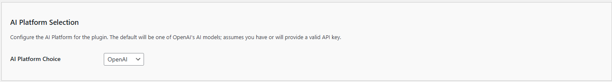
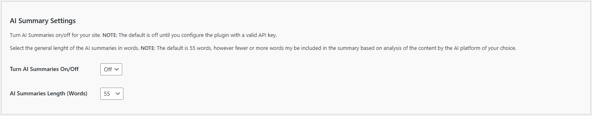

# General Settings

The General Settings allow you to customize the basic behavior the Kognetiks AI Summary plugin. Follow these steps to configure these options:

## AI Platform Selection

1. **AI Platform Choice**:

   - **Description**: This setting determines which AI model provider will be used for AI summarization.
   - **Options**: `OpenAI`, `NVIDIA`, `Anthropic`, `DeepSeek`, `Mistral`, `Google`, and `Local`.
   - **Default Value**: By default this value will be set to `OpenAI` as the model provider of choice.
   - **Note**: An valid API key obtained from the respective model vendor is required for the plugin to operate correctly.

## AI Summary Settings

1. **Turn AI Summaries On/Off**:

   - **Description**: These settings determines if the site excerpts will be replaced with AI generated summaries.
   - **Options**: `On` to replace excerpts with an AI generated summary or `Off` to use excerpts generated by WordPress otherwise stored.
   - **Default Value**: By defaults this value will be set to `Off` until you've added a valid `API` key.

2. **AI Summaries Length (Words)**:

   - **Description**: This setting sets the approximate length in words of the AI generated summary.
   - **Default Value**: By default this value will be set to `55` words.
   - **Note**: The summary generated could be slight less or slightly more depending on the complexity of your content and the capabilities of the AI model you've selected.

---

* **[Back to the Overview](/overview.md)**
