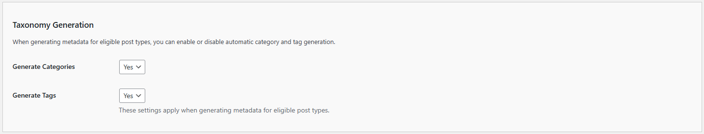
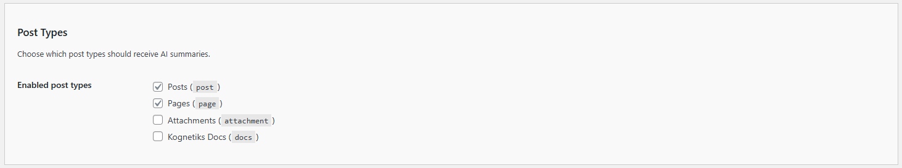

# Summaries Settings

The Summaries Settings allow you to customize the category, tag and post creation using the Kognetiks AI Summary plugin. Follow these steps to configure these options:

## LLM Prompt Instructions

Customize the instructions sent to the LLM for generating summaries, categories, and tags. The word/category/tag count from your General settings is automatically appended to these instructions, so you can focus on the instruction text itself.

1. **Summary Instructions**:

   - **Description**: Customize the prompt prefix sent to the LLM when generating AI summaries. The plugin appends the word count (from General settings) and the instruction to return only the summary text.
   - **Default Value**: `Here are some special instructions for the content that follows - please summarize this content in `
   - **Note**: The word count from the **Summary Length** setting in General is automatically appended, followed by `or fewer words and just return the summary text without stating that it is a summary: `. Edit this field to change the tone, language, or style of the summary request.

2. **Categories Instructions**:

   - **Description**: Customize the prompt prefix sent to the LLM when generating AI-suggested categories. The plugin appends the category count (from General settings) and the instruction to return comma-separated categories.
   - **Default Value**: `Here are some special instructions for the content that follows - please suggest `
   - **Note**: The category count from General settings is automatically appended, followed by `one-word (no compound words) categories or fewer and just return the categories separated by commas without stating that these are the categories: `. Edit this field to refine how the AI suggests categories.

3. **Tags Instructions**:

   - **Description**: Customize the prompt prefix sent to the LLM when generating AI-suggested tags. The plugin appends the tag count (from General settings) and the instruction to return comma-separated tags.
   - **Default Value**: `Here are some special instructions for the content that follows - please suggest `
   - **Note**: The tag count from General settings is automatically appended, followed by `one-word (no compound words) tags or fewer and just return the tags separated by commas without stating that these are the tags: `. Edit this field to refine how the AI suggests tags.

## Taxonomy Generation

1. **Generate Categories**:

   - **Description**: This setting controls whether the plugin automatically generates and assigns categories to posts when generating AI metadata.
   - **Options**: `Yes` to enable AI-generated category assignment, or `No` to skip category generation.
   - **Default Value**: By default this value is set to `Yes`.
   - **Note**: When enabled, the AI analyzes post content and suggests relevant categories. New categories are created if they do not already exist. This setting applies only when generating metadata for eligible post types.

2. **Generate Tags**:

   - **Description**: This setting controls whether the plugin automatically generates and assigns tags to posts when generating AI metadata.
   - **Options**: `Yes` to enable AI-generated tag assignment, or `No` to skip tag generation.
   - **Default Value**: By default this value is set to `Yes`.
   - **Note**: When enabled, the AI analyzes post content and suggests relevant tags. These settings apply when generating metadata for eligible post types.

## Post Types

1. **Enabled Post Types**:

   - **Description**: Choose which WordPress post types should receive AI summaries and metadata generation.
   - **Options**: A checkbox for each public post type on your site (e.g., `Posts`, `Pages`, and any custom post types).
   - **Default Value**: By default, `Posts` and `Pages` are enabled; all other public post types are disabled.
   - **Note**: Only post types you enable here will have AI summaries generated and displayed. Custom post types registered as public will appear in this list.

---

* **[Back to the Overview](/overview.md)**