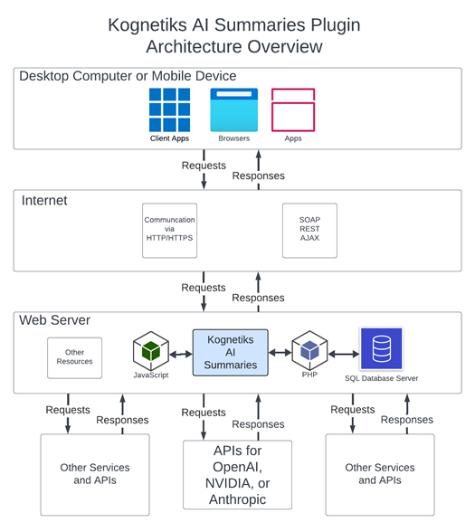

# How the Kognetiks AI Summaries Plugin Works

Imagine you would like to have a short, well-crafted summary of a page, post or other content on your site.  The **Kognetiks AI Summaries** plugin integrated with a Large Language Model (LLM) from OpenAI, NVIDIA or Anthropic, can ask the artificial intelligent (AI) platform to do just that.

An excerpt in WordPress is a brief summary or description of a post that helps readers understand the content before clicking through to read the full article. Excerpts are typically displayed on archive pages, such as category and tag pages, as well as on the homepage, making it easier for visitors to navigate and engage with your site.

# There Are Two Main Way to Create Excerpts

There are two main ways to create excerpts, automatically and manually. By default, WordPress generates an excerpt by taking the first 55 words of a post, stripping out any HTML tags. Users can also manually enter a custom excerpt in the designated Excerpt field within the post editor. If no excerpt is provided, WordPress will use the automatically generated version.

# Now There's A Third Way

Now there's a third way to generate excerpts using the **Kognetiks AI Summaries** plugin coupled with the power of Large Language Models from OpenAI, NVIDIA, or Anthropic.

Using excerpts effectively, no matter whether they were automatically generated, manually generate or magically generated by AI, can enhance user experience by providing concise summaries that encourage readers to explore more content on your site.

# How It Works - Step-by-step

Here’s how it all works, step by step, using the diagram as our guide:

1. **Desktop Computer or Mobile Device**:

   - You, the user, interact with the chatbot using various devices like a desktop computer, a mobile phone, or a tablet.

   - You access your website through different applications, such as web browsers (like Chrome or Safari) or client apps.

   - If your site displays a page, post or other content excerpt, instead of displaying 

2. **Internet**:

   - When you visit your website, your device sends this request over the internet.

   - The internet acts as a bridge, carrying your request to the web server where the WordPress site lives.

3. **Web Server**:

   - The web server is where the **Kognetiks AI Summaries** plugins is hosted.

   - The web server processes a request on your site for an excerpt and communicates with various components to generate an answer.

4. **Components on the Web Server**:

   - **JavaScript and PHP**: These are programming languages that help the chatbot process your request. JavaScript handles things on the user’s side, making sure the plugin responds quickly and smoothly. PHP works on the server side, managing the logic and data processing.

   - **SQL Database Server**: This is where the plugin stores and retrieves information. When you visit a page with an excerpt, the plugin will first look to see if an excerpt already is in the database or if not, dispatch a request to generate one.

   - **APIs**: When the plugin needs to generate an excerpt, it uses the AI platform of you choice, either OpenAI, NVIDIA, or Anthropic.  These AI platforms host powerful artificial intelligent algorithms that are used to generate concise, well craft summaries of your content that is easy to understand.

   - **Other Services and APIs**: The platform might also reach out to other services and APIs (Application Programming Interfaces) to gather additional information or perform specific tasks.

5. **Flow of Requests and Responses**:

   - Your request to visit a page, post or other content travels from your device to the web server via the internet.
   - The web server processes your request using JavaScript, PHP, and may consult the SQL Database or the API.
   - Once your site has the information it needs, it sends the response back to your device through the internet.
   - Your device then displays the excerpt, allowing you to read the answer.

# Summary

The **Kognetiks AI Summaries** plugin generates concise, well-crafted summaries (excerpts) for website content using advanced Large Language Models (LLMs) from OpenAI, NVIDIA, or Anthropic. Traditionally, WordPress excerpts were created automatically (using the first 55 words of a post) or manually (entered by users). This plugin introduces a third option: AI-powered excerpt generation.  By enhancing navigation and engagement, AI-generated excerpts streamline content consumption and improve user experience.

---

- **[Back to the Overview](/overview.md)**
