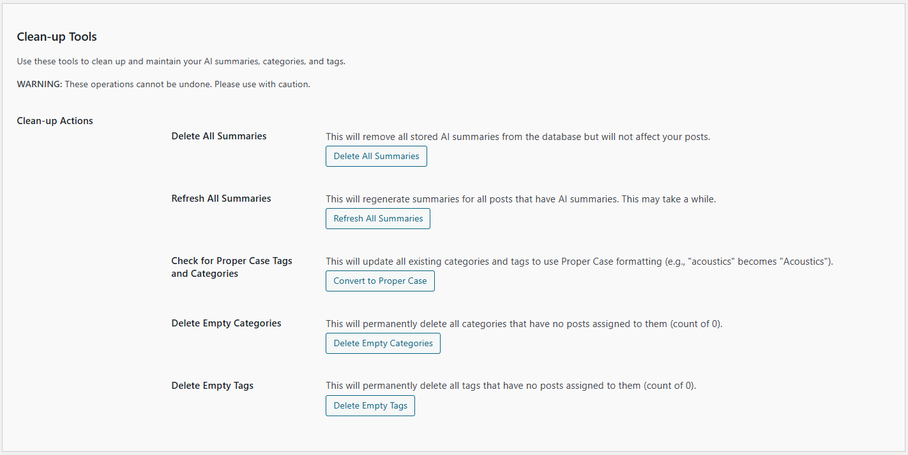

# Tools

There are three tools currently available:

- Options Exporter
- Manage Error Logs
- Clean-up Tools

These tools are briefly described below.

---

## Options Exporter

Export the Kognetiks AI Summaries options to a file.  This excludes sensitive information such as your API key.

### Steps:

1. **Download Options Data**:

   - Use the `Download Options Data` button to retrieve the Kognetiks AI Summaries options and download the file.

---

## Manage Error Logs:

The Manage Error Logs section provides direct access to the Kognetiks AI Summaries' unique errors.  If you're experiencing a problem with the Kognetiks AI Summaries, please check the error logs to see if you can determine what might be the problem.

### Steps:

1. **Download**
    - Choose `Download` to retrieve and save locally the selected error log.

2. **Delete**
    - Choose `Delete` to delete the selected error log.

3. **Delete All**
    - Chose `Delete All` to delete ALL error logs listed.

---

## Clean-up Tools:

Use these tools to clean up and maintain your AI summaries, categories, and tags.

**WARNING:** These operations cannot be undone. Please use with caution.

### Clean-up Actions:

1. **Delete All Summaries**:
   - **Description:** This will remove all stored AI summaries from the database but will not affect your posts.
   - **Action:** Use the `Delete All Summaries` button to permanently remove all AI summaries from the database.

2. **Refresh All Summaries**:
   - **Description:** This will regenerate summaries for all posts that have AI summaries. This may take a while.  This can also be expensive if you are on an AI Platform where there is a cost for tokens. **Therefore, exercise caution.**
   - **Action:** Use the `Refresh All Summaries` button to regenerate all existing AI summaries.

3. **Check for Proper Case Tags and Categories**:
   - **Description:** This will update all existing categories and tags to use Proper Case formatting (e.g., "acoustics" becomes "Acoustics").
   - **Action:** Use the `Convert to Proper Case` button to update all categories and tags to Proper Case formatting.

4. **Delete Empty Categories**:
   - **Description:** This will permanently delete all categories that have no posts assigned to them (count of 0).
   - **Action:** Use the `Delete Empty Categories` button to remove all unused categories from your site.

5. **Delete Empty Tags**:
   - **Description:** This will permanently delete all tags that have no posts assigned to them (count of 0).
   - **Action:** Use the `Delete Empty Tags` button to remove all unused tags from your site.

---

- **[Back to the Overview](/overview.md)**
