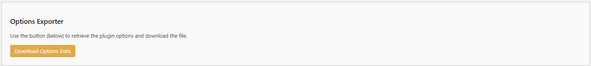
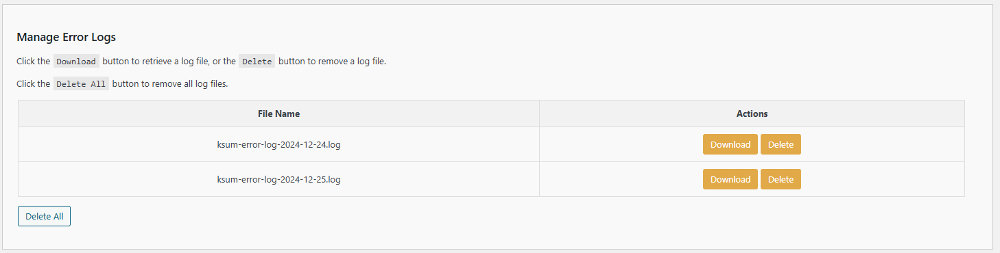

# Tools

There are two tools currently available:

- Options Exporter
- Manage Error Logs

These tools are briefly described below.

---

## Options Exporter

Export the Kognetiks AI Summaries options to a file.  This excludes sensitive information such as your API key.

### Steps:

1. **Download Options Data**:

   - Use the `Download Options Data` button to retrieve the Kognetiks AI Summaries options and download the file.

---

## Manage Error Logs:

The Manage Error Logs section provides direct access to the Kognetiks AI Summaries' unique errors.  If you're experiencing a problem with the Kognetiks AI Summaries, please check the error logs to see if you can determine what might be the problem.

### Steps:

1. **Download**
    - Choose `Download` to retrieve and save locally the selected error log.

2. **Delete**
    - Choose `Delete` to delete the selected error log.

3. **Delete All**
    - Chose `Delete All` to delete ALL error logs listed.

---

- **[Back to the Overview](/overview.md)**
